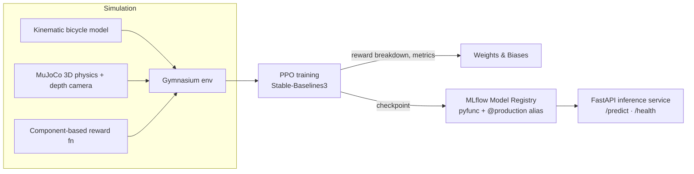

# Off-road Autonomous Navigator

**An end-to-end reinforcement learning system for autonomous off-road navigation, from a custom physics environment to a versioned model served over an API.**

A PPO agent learns to drive a car-like vehicle to a goal. The project covers the full ML lifecycle: environment design, reward engineering, experiment tracking, model registry and promotion, inference serving and testing. It is now being extended from a 2D kinematic model to a 3D MuJoCo simulation with depth-camera perception.


<p align="center">
  
  
  <br/>
  <em>Left: 4-wheel Ackermann vehicle in MuJoCo. Right: the 64×64 depth image the agent receives from its front camera.</em>
</p>

---

## Why this project

Most RL tutorials stop at `model.learn()`. This project is built like a production ML system: typed configs, a tested environment, per-component reward monitoring, a model registry with promotion aliases, and an inference service that degrades cleanly when no model is available.

## Architecture



## What's inside

| Area | Implementation |
|---|---|
| **Environment** | Custom Gymnasium env with Ackermann (bicycle) kinematics, normalized `[-1, 1]` action space, strict `terminated` / `truncated` separation for correct advantage bootstrapping |
| **Reward engineering** | Separate progress, border-proximity, energy and step terms plus goal and collision terminals, each returned in a `RewardBreakdown` and logged to W&B |
| **Training** | PPO (Stable-Baselines3) with custom callbacks aligning reward components to the global step |
| **Model registry** | Policy wrapped as an `mlflow.pyfunc` model with a typed signature, registered and promoted via the `@production` alias |
| **Serving** | FastAPI service loading `models:/offroad-agent@production` at startup (lifespan), Pydantic request/response schemas, `503` + `degraded` health status if the model fails to load |
| **3D simulation** | MuJoCo 4-wheel vehicle with Ackermann steering constraints, frame-skipping between decision steps (0.1 s) and physics steps (0.002 s) |
| **Perception** | Front depth camera producing normalized `(1, 64, 64)` float32 images, `Dict` observation space (`depth` + `vector`) and a custom CNN feature extractor for SB3's `MultiInputPolicy` |
| **Config** | Frozen Pydantic `BaseSettings` loaded from YAML, overridable via `OFFROAD_*` env vars |
| **Quality** | 88 pytest tests, `mypy --strict`, `ruff`, dependencies locked with `uv` |

## Results so far

- **Kinematic baseline:** PPO trained for 200k timesteps; mean episode reward stabilized at ~107 (the goal bonus alone is 100, so episodes end at the goal). Registered in MLflow as the production model and served through the API.
- **MuJoCo vision env:** the full perception pipeline (physics → depth camera → CNN → policy) runs end to end. Training is in progress (see engineering notes).

## Engineering notes

Some of the more instructive problems along the way:

- **Silent reward bug:** `prev_state` was captured after the state update in `step()`, so the progress reward was always zero. The agent trained "fine" but learned nothing useful. Caught in code review, and now covered by tests.
- **Diagnosing a training plateau without more compute:** the MuJoCo agent stalled at ~28 m from the goal. Instead of training longer, I wrote a hand-coded optimal controller: even it needed ~900–1000 steps to reach the goal, while episodes were capped at 100 (inherited from the kinematic config). The problem was the environment, not the learner. Physics-based dynamics need their own calibration.
- **Single source of truth for shapes:** the environment owns the observation contract, including the depth image's channel dimension, so the CNN never reshapes its inputs.

## Quickstart

Requires Python 3.11 and [uv](https://docs.astral.sh/uv/).

```bash
git clone https://github.com/CidCos/offroad-autonomous-navigator.git
cd offroad-autonomous-navigator
uv sync

# Run the test suite (use MUJOCO_GL=egl on a headless machine)
uv run pytest

# Train a PPO agent (logs to Weights & Biases)
uv run python -m experiments.train

# Register the trained model in MLflow and promote it to @production
# (set the W&B run ID and checkpoint path in the script first)
uv run python -m experiments.register_model
uv run python -m experiments.promote_model

# Serve it
export MLFLOW_TRACKING_URI=sqlite:///mlflow.db
uv run fastapi dev src/offroad_autonomous_navigator/api/main.py
```

Example request:

```bash
curl -X POST localhost:8000/predict -H "Content-Type: application/json" \
  -d '{"x": 0, "y": 0, "theta": 0, "v": 0, "goal_x": 20, "goal_y": 20}'
# -> {"steering_angle": ..., "acceleration": ...}
```

## Project structure

```
src/offroad_autonomous_navigator/
├── envs/
│   ├── kinematic/     # Bicycle-model dynamics + Gymnasium env
│   ├── mujoco/        # Physics wrapper, depth camera, vector & vision envs
│   ├── reward_fn.py   # Component-based reward
│   ├── observation.py # State → observation, action scaling (shared by envs and API)
│   └── schemas.py     # Pydantic state, action, config and reward schemas
├── models/            # CNN feature extractor for depth images
├── api/               # FastAPI inference service
└── utils/             # Geometry, YAML config loader
experiments/           # Training, callbacks, MLflow registration and promotion
config/                # Environment and reward YAML configs
assets/mujoco/         # Vehicle MJCF model
tests/                 # 88 tests
```

## Roadmap

- [x] Phase 1: Kinematic environment, Pydantic schemas, full test coverage
- [x] Phase 2: Reward shaping, PPO training, W&B monitoring
- [x] Phase 3: MLflow registry, model promotion, FastAPI inference service
- [ ] Phase 4: MuJoCo 3D simulation with depth perception (*in progress*: recalibrating episode length and goal distance for real vehicle dynamics, then training the vision policy)
- [ ] Phase 5: Docker image and CI pipeline (ruff, mypy, pytest on every push), evaluation benchmarks

## Tech stack

Gymnasium · Stable-Baselines3 · MuJoCo · PyTorch · MLflow · Weights & Biases · FastAPI · Pydantic · pytest · mypy · ruff · uv

---

Built by **Iván Cid Costa** · [LinkedIn](https://www.linkedin.com/in/ivan-cid-costa/) · [GitHub](https://github.com/CidCos)